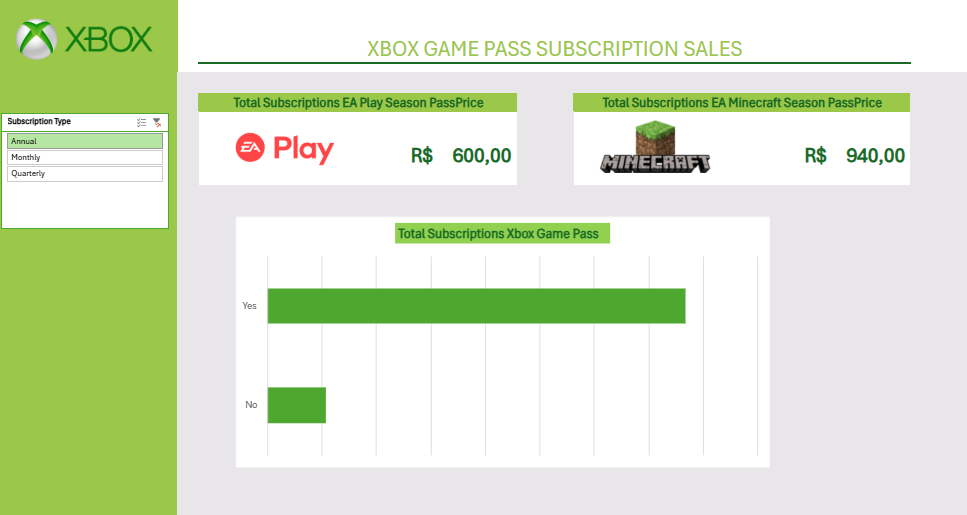

# Projeto DIO TOTVS - Dashboard de Vendas do Xbox com Excel

## Descrição
Projeto desenvolvido como desafio da DIO utilizando Microsoft Excel para análise e visualização de dados.

## Objetivos
- Organizar dados de vendas
- Criar indicadores de desempenho
- Desenvolver dashboard interativo

## Ferramentas Utilizadas
- Microsoft Excel
- Tabelas Dinâmicas
- Gráficos
- Segmentação de Dados

## Estrutura do Projeto
- Desafio Excel DIO-TOTVS.xlsx → Arquivo principal
- Dashboard.png → Captura de tela do dashboard

## Resultado

### Dashboard

## Autora
Luana Silvério de Farias
